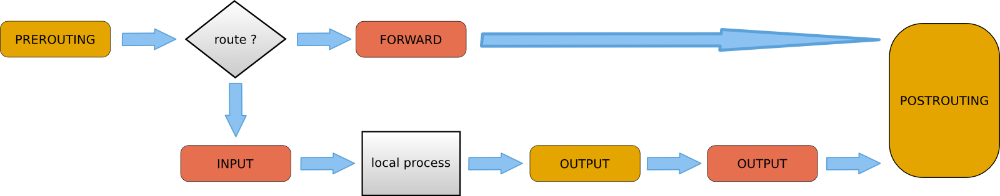

# IPTables

## Tablas

- **filter** Cortafuegos. Tabla por defecto
- **nat** Para hacer NAT
- **mangle** Marcar y modificar paquetes
- **raw** Depurar seguimiento conexión
- **security** Usada para MAC (SELinux)

## CADENAS

- Cadenas de filter
    - INPUT
    - OUTPUT
    - FORWARD 
- Cadenas de nat
    - PREROUTING
    - INPUT
    - OUTPUT
    - POSTROUTING

## Tipo de tráfico y flujo

- Paquete del exterior con destino el equipo:
    - POSTROUTING de nat e INPUT de filter
- Paquete originado en el equipo que sale
    - OUTPUT de nat, OUTPUT de filter y POSTROUTING de nat.
- Paquete que atraviesa el equipo
    - PREROUTING de nat, FORWARD de filter y POSTROUTING de nat.



***

## BASIC COMMANDS

1. Ayuda

```console
$ man iptables
```

2. Listar reglas.

```console
$ sudo iptables -L
$ iptables -L [CADENA] [-n] [-v] [--line-numbers]
$ sudo iptables -L INPUT -nv --line-numbers #Example
$ sudo iptables -L INPUT -nv #Example
$ iptables -S [CADENA] [-v]
$ sudo iptables -S FORWARD -v #Example
```

3. Añadir reglas sencillas.

- APPEND | Agrega al final del conjunto de Reglas de IPTables

```console
# iptables -A [CADENA] [-p PROTOCOLO] [-s IP ORIGEN] [-d IP DESTINO] [-i INTERFAZ ENTRADA] [-o INTERFAZ SALIDA] [-j ACCEPT|DROP]
```

```console
# iptables -A INPUT -p icmp -s 192.168.100.0/24 -i virbr1 -j ACCEPT
```

- INSERT | Agrega al princio del conjunto de Reglas de IPTables

```console
# iptables -I [CADENA] [-p PROTOCOLO] [-s IP ORIGEN] [-d IP DESTINO] [-i INTERFAZ ENTRADA] [-o INTERFAZ SALIDA] [-j ACCEPT|DROP]
```

```console
# iptables -I INPUT -p icmp -s 192.168.100.0/24 -i virbr1 -j ACCEPT
```

4. Eliminar reglas.

- CHECK | Verificamos que la regla existe, si no nos devuelve nada, existe la regla caso contrario el output sera **Bad rule....**

```console
# iptables -C [CADENA] [-p PROTOCOLO] [-s IP ORIGEN] [-d IP DESTINO] [-i INTERFAZ ENTRADA] [-o INTERFAZ SALIDA] [-j ACCEPT|DROP]
```

```console
# iptables -C INPUT -p icmp -s 192.168.100.0/24 -i virbr1 -j ACCEPT
```

- DELETE

```console
# iptables -D [CADENA] [-p PROTOCOLO] [-s IP ORIGEN] [-d IP DESTINO] [-i INTERFAZ ENTRADA] [-o INTERFAZ SALIDA] [-j ACCEPT|DROP]
```

```console
# iptables -D INPUT -p icmp -s 192.168.100.0/24 -i virbr1 -j ACCEPT
```

```console
# iptables -D [CADENA] NUMERO 
```

```console
# iptables -L -nv --line-numbers
# iptables -D INPUT 2
```

5. Limpiar

- FLUSH | Elimina Todas las reglas de INPUT

```console
# iptables -F [CADENA]
```

```console
# iptables -F INPUT
```

- ZERO | Poner a cero el contador de paquetes.

```console
# iptables -Z [CADENA]
```

```console
# iptables -Z INPUT
```

- Informacion completa -> https://www.redeszone.net/tutoriales/seguridad/iptables-firewall-linux-configuracion/

## EXAMPLE | Script para hacer **nat script** en el bastion para acceder a un rds.

```bash
#!/bin/bash

#sudo su -c "echo 1 > /proc/sys/net/ipv4/ip_forward"

sudo iptables -F
sudo iptables -X
sudo iptables -t nat -F
sudo iptables -t nat -X
sudo iptables -t mangle -F
sudo iptables -t mangle -X
sudo iptables -P INPUT ACCEPT
sudo iptables -P FORWARD ACCEPT
sudo iptables -P OUTPUT ACCEPT
sudo service network restart
sudo iptables -t nat -A POSTROUTING -o eth0 -j MASQUERADE

# RDS
#IP_RDS=$(dig +short prod-rds-backdb.cj7xmzbscfxx.us-east-1.rds.amazonaws.com)
sudo iptables -t nat -A PREROUTING -p tcp --dport 5432 -j DNAT --to-destination 192.168.143.237:5432

sudo iptables -t nat -A POSTROUTING -j MASQUERADE
```